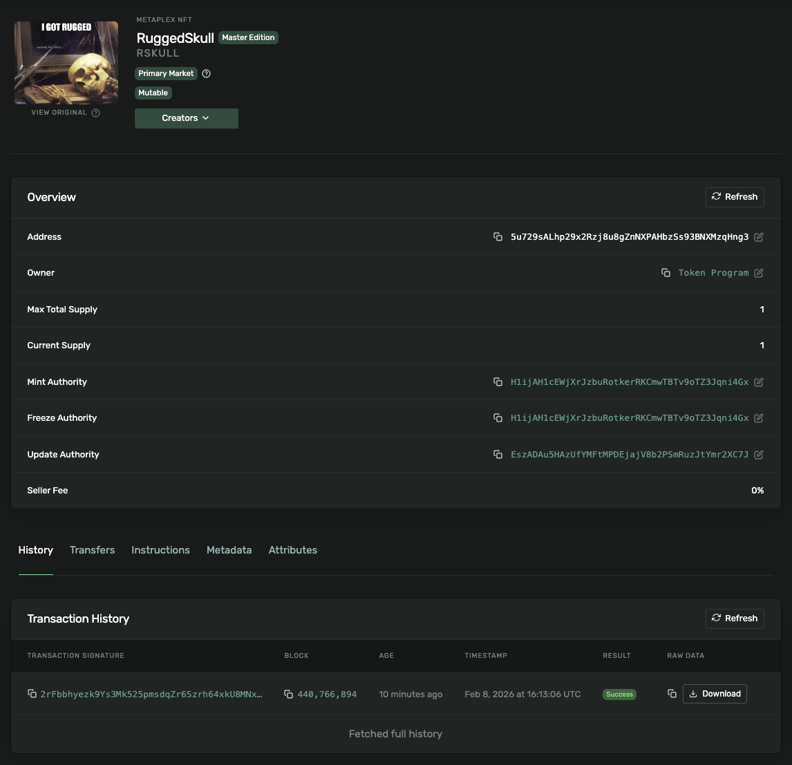

# Solana SPL Token Creation

This project demonstrates the creation and minting of an SPL token on Solana Devnet.

## Token Details

| Property | Value |
|----------|-------|
| Mint Address | `FbuSqRxxwc8Z1Y35sB4sBvvvSCZRhkbypEEPm66ahXH6` |
| Decimals | 6 |
| Network | Devnet |

## Transaction Hashes

**Token Mint Transaction:**
```
57MLAn4bgMzBF2MY3LBWvWacgjuZNmbUdtZT1EovUpz5JJhZygUZuB5xaqZ1QzwNHoLFJEDFkh2LiRidGC2Ew3f1
```

## Solana Explorer Links

Token: https://explorer.solana.com/address/FbuSqRxxwc8Z1Y35sB4sBvvvSCZRhkbypEEPm66ahXH6?cluster=devnet

Mint Transaction: https://explorer.solana.com/tx/57MLAn4bgMzBF2MY3LBWvWacgjuZNmbUdtZT1EovUpz5JJhZygUZuB5xaqZ1QzwNHoLFJEDFkh2LiRidGC2Ew3f1?cluster=devnet

## Steps Performed

1. Generated a new Solana keypair for the wallet.
2. Requested an airdrop of 2 SOL on Devnet for transaction fees.
3. Created a new SPL Token mint with 6 decimal places using `createMint`.
4. Created an Associated Token Account (ATA) for the wallet.
5. Minted 1,000,000 tokens to the ATA using `mintTo`.

## Project Structure

```
ts/
├── cluster1/
│   ├── spl_init.ts      # Token mint creation script
│   ├── spl_mint.ts      # Token minting script
│   ├── spl_transfer.ts  # Token transfer script
│   └── spl_metadata.ts  # Token metadata script
├── turbin3-wallet.json  # Wallet keypair
└── package.json
```

## Running the Scripts

```bash
cd ts
npm install
npm run spl_init      # Create token mint
npm run spl_mint      # Mint tokens to wallet
npm run spl_transfer  # Transfer tokens to another wallet
```

---

# NFT Minting

## Rugged Skull NFT



| Property | Value |
|----------|-------|
| Name | Rugged Skull |
| Symbol | RSKULL |
| Mint Address | `5u729sALhp29x2Rzj8u8gZnNXPAHbzSs93BNXMzqHng3` |
| Network | Devnet |

## NFT Transaction Hash

```
2rFbbhyezk9Ys3Mk525pmsdqZr6Szrh64xkU8MNx7GWWWAMYw9C2C5PcNr4csUsb5F7kT9aZMhzgdw2Qg8qQyZAJ
```

## NFT Explorer Links

Mint Address: https://explorer.solana.com/address/5u729sALhp29x2Rzj8u8gZnNXPAHbzSs93BNXMzqHng3?cluster=devnet

Mint Transaction: https://explorer.solana.com/tx/2rFbbhyezk9Ys3Mk525pmsdqZr6Szrh64xkU8MNx7GWWWAMYw9C2C5PcNr4csUsb5F7kT9aZMhzgdw2Qg8qQyZAJ?cluster=devnet

## NFT Metadata

Image URI: https://gateway.irys.xyz/FZ64SH5yDrWUzsPjK8JATjRnpTHaeVGv45juF5wq4y5y

Metadata URI: https://gateway.irys.xyz/DNUAiRevn8ay4aX46YWCujuytUW5mv9uB94vqBwGUUrg

## NFT Minting Scripts

```bash
cd ts
npx ts-node cluster1/nft_image.ts     # Upload image to Irys
npx ts-node cluster1/nft_metadata.ts  # Upload metadata to Irys
npx ts-node cluster1/nft_mint.ts      # Mint the NFT
```
